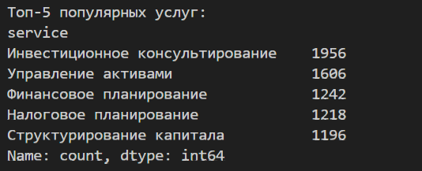
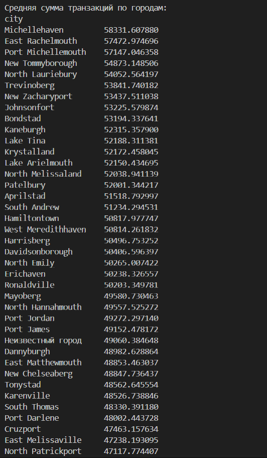
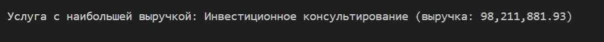
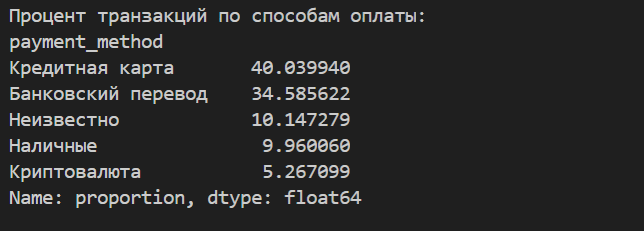
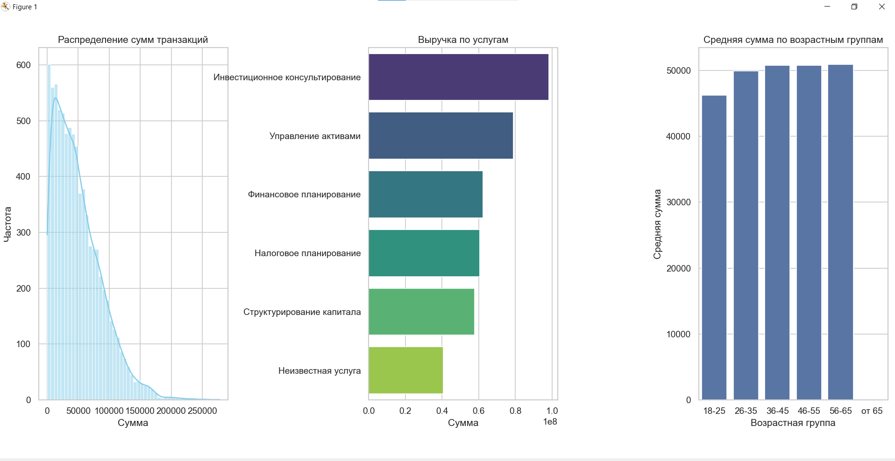

# Анализ финансовых транзакций

## Анализ данных

**Топ-5 популярных услуг по количеству заказов**


**Средняя сумма транзакций по городам**



**Услуга с наибольшей выручкой**



**Процент транзакций по способам оплаты**



**Выручка за последний месяц**



**Анализ по уровням активов клиентов**


**Прогнозирование выручки на следующий месяц**
Использовалась модель линейной регрессии (`LinearRegression` из `sklearn`) по исторической ежемесячной выручке.


### Визуализация данных
Построены три графика с помощью библиотек `matplotlib` и `seaborn`:
1. Распределение сумм транзакций.
2. Столбчатая диаграмма суммарной выручки в разрезе услуг.
3. График средней суммы транзакции в зависимости от возрастной группы клиентов.




## Запуск проекта

Выполнение скрипта:
```bash
python solution.py --transactions transactions_data.xlsx --clients clients_data.json
```

Ззависимости в requirements.txt